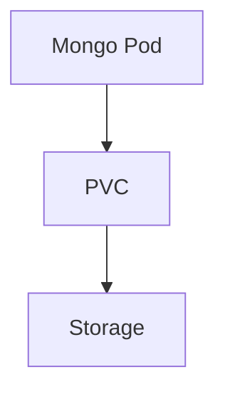
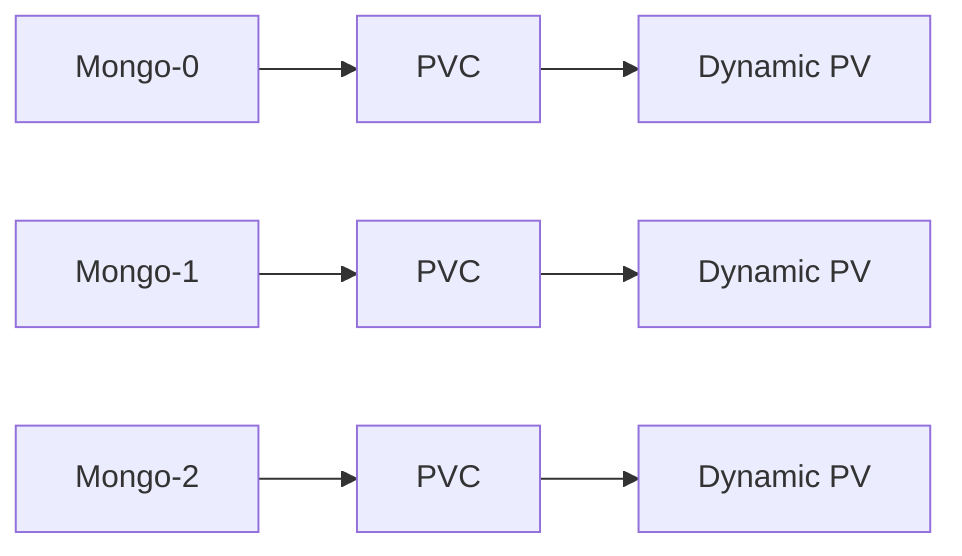
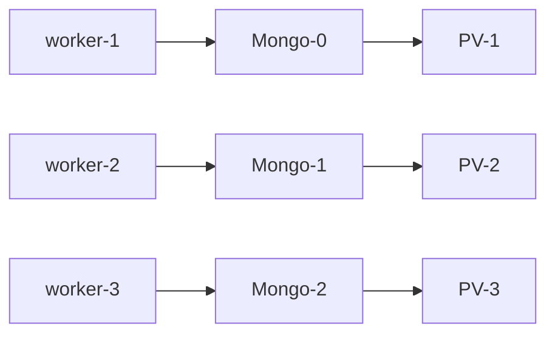

# MongoDB in Kubernetes

This repository describes architectural approaches for running MongoDB with Kubernetes and demonstrates a production architecture with **controlled storage topology**.

The goal of this repository is to explain engineering trade-offs and operational considerations when running databases inside Kubernetes.

This is **not a tutorial on installing MongoDB**.
This repository focuses on **architecture decisions and operational trade-offs**.

---

# MongoDB + Kubernetes: Possible Architectures

There are several ways MongoDB can be used together with Kubernetes.
Each approach has its own advantages, limitations, and appropriate use cases.

| Scenario | Implementation Complexity | Storage Reliability | Operational Predictability | Scaling Flexibility |
|---|---|---|---|---|
| MongoDB outside Kubernetes | Medium | Very High | Very High | Low |
| Single MongoDB instance in Kubernetes | Low | Low | Medium | None |
| MongoDB ReplicaSet with dynamic storage | Medium | Medium | Low | High |
| MongoDB ReplicaSet with controlled storage | High | High | High | Medium |

---

# 1. MongoDB Outside Kubernetes

In this architecture MongoDB runs on separate servers or virtual machines.
The Kubernetes cluster connects to the database over the network.


## Pros

* fully independent storage infrastructure
* predictable storage behavior
* simpler backup and recovery strategies
* less dependency on Kubernetes scheduling
* easier operational management

## Cons

* separate infrastructure
* separate database lifecycle
* additional network hop between application and database
* possible increase in query latency

## Use Cases

This is **the most common and recommended approach for production workloads**, even when applications run inside Kubernetes.

It works best when:

* the database is critical
* storage predictability is important
* infrastructure is separated into **application layer (Kubernetes)** and **database layer (dedicated servers)**
* Kubernetes is used primarily for **stateless workloads**
* the team wants to avoid turning Kubernetes into a **fully stateful platform**

Kubernetes works best when it remains **lightweight and elastic**.

When a cluster starts hosting large stateful systems (especially databases), operations often become:

* more complex
* more rigid
* less predictable

For this reason many production systems keep the database **outside Kubernetes**, even when all applications run inside the cluster.

---

# 2. Single MongoDB Instance in Kubernetes

MongoDB runs as a single Pod inside Kubernetes.



## Pros

* extremely simple architecture
* very quick deployment
* convenient for development and testing

## Cons

* no high availability
* Pod failure makes the database unavailable
* potential risk of data loss
* not suitable for production workloads

## Use Cases

Typically used for:

* development environments
* staging environments
* testing setups
* small internal tools

---

# 3. MongoDB ReplicaSet with Dynamic Storage

MongoDB runs as a StatefulSet.
PersistentVolumeClaims are created automatically through a StorageClass.



## Pros

* Kubernetes automatically manages storage
* less manual configuration
* fast infrastructure deployment
* easy environment creation
* convenient horizontal scaling

## Cons

* reduced control over data placement
* volumes may be attached to unexpected nodes
* attach/detach operations can take significant time
* node failures may create complex recovery scenarios

In real clusters situations may occur where:

* a node fails
* the Pod is rescheduled to another node
* the volume cannot be reattached quickly
* the Pod enters **CrashLoopBackOff**

These issues complicate database operations.

A specific and well-known failure mode is the **Multi-Attach error**:

* a node becomes unavailable
* the disk remains attached to the old node at the cloud/storage level
* Kubernetes attempts to schedule the Pod on a new node
* the disk cannot be mounted because it is still associated with the previous node
* the Pod stays in **ContainerCreating** state indefinitely, waiting for the volume to detach

This situation requires manual intervention and can result in significant downtime for the affected ReplicaSet member.

Overall stability of this architecture heavily depends on the quality and reliability of the CSI driver provided by the underlying platform (e.g. AWS EBS, Google Persistent Disk, Azure Disk).

## Use Cases

This approach is used when **speed and infrastructure flexibility are more important than storage determinism**.

It works best when:

* environments need to be created quickly
* infrastructure is frequently recreated
* systems scale both up and down frequently
* the team accepts the risk of storage-related issues

The operational philosophy here is often:

```
something breaks → recreate pod → recreate storage → continue operating
```

This model prioritizes **speed of infrastructure** over **predictability of storage topology**.

---

# 4. MongoDB ReplicaSet with Controlled Storage

MongoDB runs as a StatefulSet, but storage is managed manually.

Static PersistentVolumes are created in advance and Pod placement is controlled.



## Architecture Characteristics

* each Pod uses a pre-created PersistentVolume
* each volume is bound to a specific node
* Pod placement is controlled using node affinity
* storage topology is fully predictable

## Pros

* full control over data placement
* deterministic storage topology
* easier troubleshooting
* faster recovery during incidents
* clear understanding of where data physically resides

## Cons

* more manual configuration
* scaling requires preparing new volumes
* higher operational responsibility

## Use Cases

This architecture is a **compromise between two worlds**:

* running the database **inside Kubernetes**
* maintaining **strict control over storage placement**

It is appropriate when:

* the database must run inside Kubernetes
* the team needs to know exactly **where data is stored**
* incident investigation must be straightforward
* recovery operations must be predictable
* the team does not want to rely entirely on dynamic storage systems

The core design principle is:

```
Pod → specific PVC → specific PV → specific Node
```

Kubernetes manages the **process lifecycle**,
while storage topology remains **explicitly controlled by the operator**.

---

# Key Engineering Principle

MongoDB handles **node failures well** thanks to ReplicaSet election.

However, MongoDB does **not handle unpredictable storage relocation well**.

Because of this, running MongoDB in Kubernetes often requires controlling **storage topology**, not only Pod orchestration.

This repository demonstrates one such architecture.
